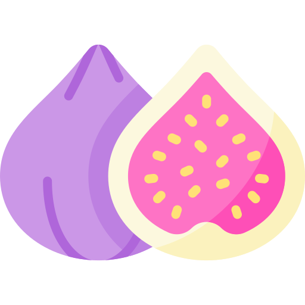

<p align="center">
<picture>
  <source media="(prefers-color-scheme: dark)" srcset="./.github/fig.png">
  <source media="(prefers-color-scheme: light)" srcset="./.github/fig-outlined.png">
  
</picture>
</p>

<h1 align="center">
  Figue - Application configuration management
</h1>
<p align="center">
  The modern way to handle and validate your application configuration with any standard-schema-compliant validation library.
</p>


## Introduction

Figue is a modern configuration management library for Node.js. It is designed to be easy to use, flexible, it can used in any environment, and can be used with any standard-schema-compliant validation library, like [zod](https://github.com/colinhacks/zod) or [valibot](https://github.com/fabian-hiller/valibot).

Think of it as a modern version of [convict](https://github.com/mozilla/node-convict/tree/master/packages/convict) but simpler, cross env and using battle tested validation libraries.

## Features

- Environment variables support
- Validation with any standard-schema-compliant validation library
- Flat object support
- Multiple sources of configuration
- Type-safe configuration
- Composable configuration
- No runtime dependencies

## Usage

Install package:

```sh
# pnpm
pnpm install figue

# npm
npm install figue

# yarn
yarn install figue

```

Import:

```js
// ESM
import { defineConfig } from 'figue';

// CommonJS
const { defineConfig } = require('figue');
```

## API

### Basic example

Use the `defineConfig` function to define your configuration, here with [valibot](https://github.com/fabian-hiller/valibot):

```typescript
import { defineConfig } from 'figue';
import * as v from 'valibot';

const { config } = defineConfig(
  {
    env: {
      doc: 'Application current environment',
      default: 'development',
      schema: v.picklist(['development', 'production', 'test']),
      env: 'NODE_ENV',
    },
    port: {
      doc: 'Application port to listen',
      schema: v.pipe(v.union([v.number(), v.string()]), v.transform(Number)),
      default: 3000,
      env: 'PORT',
    },
    db: {
      host: {
        doc: 'Database server url',
        schema: v.pipe(v.string(), v.url()),
        default: 'http://localhost:5432',
        env: 'APP_DB_HOST',
      },
      username: {
        doc: 'Database server username',
        schema: v.string(),
        default: 'pg',
        env: 'APP_DB_USERNAME',
      },
      password: {
        doc: 'Database server password',
        schema: v.string(),
        default: '',
        env: 'APP_DB_PASSWORD',
      },
    },
  },
  {
    envSource: process.env,
  },
);

console.log(config);
// {
//   env: "development",
//   port: 3000,
//   db: {
//     url: "https://localhost",
//     username: "pg",
//     password: "",
//   },
// }
```

You can see more examples in the [demo](./demo) folder.
- Figue with zod: [demo/figue-zod.ts](./demo/figue-zod.ts)
- Figue with valibot: [demo/figue-valibot.ts](./demo/figue-valibot.ts)

### Load environnement

Use the `envSource` key of the second argument of `defineConfig` to specify the source of the environment variables:

```typescript
const { config } = defineConfig(
  {
    /* ... */
  },
  {
    envSource: process.env,
  },
);
```

In some case you don't have access to a `process.env` variable, like with `vite`, just simply load what stores your env variables :

```typescript
const { config } = defineConfig(
  {
    /* ... */
  },
  {
    envSource: import.meta.env,
  },
);
```

You can even specify you custom environment storage as long as it's a simple flat object map, for example:

```typescript
const { config } = defineConfig(
  {
    env: {
      doc: 'Application current environment',
      default: 'development',
      schema: z.enum(['development', 'production', 'test']),
      env: 'NODE_ENV',
    },

    /* ... */
  },
  {
    envSource: {
      NODE_ENV: 'development',
      PORT: '3000',
      APP_DB_HOST: 'localhost',
      APP_DB_USERNAME: 'pg',
      APP_DB_PASSWORD: '',
    },
  },
);
```

If, for some reason, you have multiple sources of environment variables, you can use the `envSources` key of the second argument of `defineConfig` to specify an array of sources:

```typescript
const { config } = defineConfig(
  {
    /* ... */
  },
  {
    envSource: [import.meta.env, myEnvs],
  },
);
```

### Environment variable fallback

You can specify multiple environment variable names for a single configuration field by providing an array of strings. Figue will use the first environment variable that is found in your environment sources.

This feature is particularly useful when:
- Supporting multiple deployment environments with different environment variable naming conventions
- Migrating from legacy environment variable names while maintaining backward compatibility
- Providing fallback options for missing environment variables

```typescript
const { config } = defineConfig(
  {
    port: {
      doc: 'Application port to listen',
      schema: z.coerce.number(),
      default: 3000,
      // Will use PORT if available, otherwise APP_PORT, otherwise SERVER_PORT
      env: ['PORT', 'APP_PORT', 'SERVER_PORT'],
    },
    database: {
      host: {
        doc: 'Database host',
        schema: z.string(),
        default: 'localhost',
        // Useful for supporting legacy environment variable names
        env: ['DATABASE_HOST', 'DB_HOST', 'LEGACY_DB_URL'],
      },
    },
    workerId: {
      doc: 'Worker identifier',
      schema: z.string().optional(),
      // Or using some plateform specific environment variable
      env: ['WORKER_ID', 'HEROKU_DYNO_ID', 'RENDER_INSTANCE_ID'],
    },
  },
  {
    envSource: process.env,
  },
);
```


Some caveats:
- If none of the specified environment variables are found, Figue will fall back to the default as expected when no `env` key is present.
- If a variable is found but its value is nullish or falsy (like an empty string, or undefined), Figue will still consider it as set and use that value. If you want to ignore such values, you should handle that in your schema validation.
- Ensure that the order of environment variables in the array reflects their priority, as Figue will use the first one it finds.

### Get defaults

You can use the `getDefaults` key of the second argument of `defineConfig` to specify a function that will be called to get some defaults:

```typescript
const { config } = defineConfig(
  {
    env: {
      doc: 'Application current environment',
      default: 'development',
      schema: z.enum(['development', 'production', 'test']),
      env: 'NODE_ENV',
    },
    port: {
      doc: 'Application port to listen',
      schema: z.coerce.number().int().positive(),
      default: 3000,
      env: 'PORT',
    },
  },
  {
    envSource: {
      PORT: 3001,
    },
    // The config argument is build from the config definition defaults and the envSources
    // Typically you will use it to override some defaults based the config
    getDefaults: ({ config }) => ({
      port: config.env === 'test' ? 4444 : config.port,
    }),
  },
);

```

You can also use the `defaults` property of the second argument of `defineConfig` to specify some static defaults (for example taken from a json file):

```typescript
const { config } = defineConfig(
  {
    /* ... */
  },
  {
    // Either an array of config partial...
    defaults: [
      {
        port: 4444,
      },
    ],

    // ... or a single config partial
    defaults: {
      port: 4444,
    },
  },
);
```

## What's wrong with convict?

Convict is meant to be used in node based environnement, it needs to have access to global variables that may may not be present in some environnement (like `process`, `global`), and it also imports `fs`.

## Figue?

**Figue** is the french for _fig_ -> con-fig.

## Development

- Clone this repository
- Install dependencies using `pnpm install`
- Run interactive tests using `pnpm dev`

## Credits

This project is crafted with ❤️ by [Corentin Thomasset](https://corentin.tech).
If you find this project helpful, please consider [supporting my work](https://buymeacoffee.com/cthmsst).

Fig icons created by <a href="https://www.flaticon.com/free-icons/fig" title="fig icons">Freepik - Flaticon</a>

## License

This project is under the [MIT license](LICENSE).
